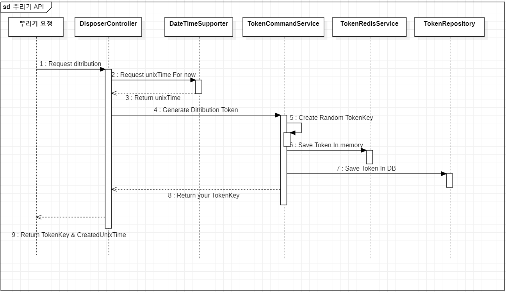

## Sequence Diagram
1. 뿌리기 API
   

1. 받기 API를 구현하기 위해서 recipient라는 table에 (id,amount,user_id,token_id)
Attribute로 정의하고, 처음 Token 생성(뿌리기 요청) 되면 user_id가 모두 null인 상태로 받기 요청을
하는 사용자로 채워지게 된다. 다시 말해 user_id가 null인 tuple은 받기 요청이 가능한 상태를 의미하며,
user_id로 채워진다면 그 유저가 받기를 성공 한 것이다.
-> 문제는 "빈번하게 일어날 write 작업에 대해서 대응할 수 있는가?"

2. 문제 요구 사항에 "token은 3자리 문자열로 구성되며 예측이 불가능해야 합니다"로 인해 토큰을 구분하는 key 값의 경우의
수는 62 x 62 x 62 = 238,328 이다. 중복될 확률은 대략 2.08%이다. 중복된 토큰에 대해서 어떻게 효율적으로 처리할 것인가?

3. 조회 API에서 10분이 지나면 데이터의 변동이 없어지게 되는데 그때에도 계속해서 Join 통한 데이터 조회가 효율적인가?
-> 그렇지 않다. 변동이 없기에 10분 뒤엔 미리 만들어진 Json 형태의 데이터를 DB에 넣고 바로바로 꺼내서 주는게 더 효율적
-> 1. 미리 만들어진 Json 형태의 결과 데이터를 넣어두는 Recipient_result table
-> 2. 10분이란 시간 이후에 어떻게 미리 생성해서 넣어 둘 것인가?? => Kafka 활용?