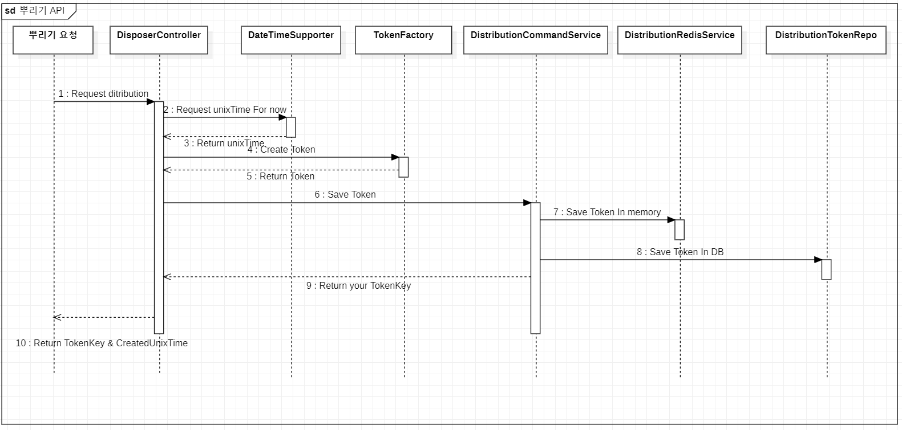
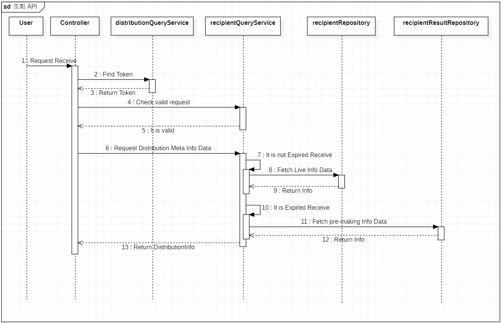

## Sequence Diagram
1. 뿌리기 API
   
2. 받기 API
   
3. 조회 API
   

## ERD
   

1. distribution_toke - 뿌리기 요청에 의해 생성된 Token Table
2. recipient - 받기 요청을 할당하고 기록하기 위한 Table
3. recipient_result - 받기가 만료된 Token에 대한 조회 데이터를 미리 Json 형태로 저장하는 Table

## API
- https://documenter.getpostman.com/view/25401186/2s9YC4VDFe

## 문제 해결 전략
1. DB에 Write 하는 작업과 Read 작업을 기준으로 Class 분리
2. Distribution Token(뿌리기 요청 Token)에 대한 Redis 적용
   - 뿌리기 요청에 의해 생성된 Token은 받기,조회 API에서도 빈번하게 조회가 필요한 상황임으로 Redis를 통해 Lazy Loading
     전략을 통해 Token 조회에 대한 작업량을 감소시키고자 함.
3. 받기 요청에 대한 비즈니스 로직
   - 받기 요청을 처리하기 위해 뿌리기 요청에 의해 Token 생성시 동시에 recipient table에 받기 요청에 대한 할당될 수 있는 recipient 추가
   - recipient table에서 user_id를 null로 초기 할당 후, 받기 요청을 하는 유저의 id를 update함으로써 받기 요청 반영.
4. 조회 요청에 대한 비효율 제거
   - 10분까지는 recipient table에서 조회 token_id와 user_id가 null이 아닌 데이터를 그때 그때 조회하여 응답.
   - 10분 이후로는 해당 Token에 대해 받기 작업이 불가함으로 recipinet에서도 관련 데이터의 변동이 없기 때문에 미리 Json 형태로 만들어 놓은 
     데이터를 갖는 recipient_result table에 저장.(저장 작업은 Spring 스케쥴링을 통해 일정 간격으로 받기 만료된 Token을 Redis에서 찾아 작업)
   -> 스케쥴링 작업을 좀 더 효율적으로 수행하기 위해 차후 메시징 큐 도입 고려
5. 시간에 대한 정확도
   - 시간과 관련된 만료 시간 체크와 같은 작업이 많기 때문에 LocalDateTime 대신 UnixTime으로 long 형태로 구현
   - 여러 서버 인스턴스의 시계 동기화를 위한 NTP 필요.

## application.properties value
- spring.redis.host=localhost
- spring.redis.port=6379
- token.receive_exp = 600000
- token.read_exp = 604800000
- token.key_resource = ABCDEFGHIJKLMNOPQRSTUVWXYZabcdefghijklmnopqrstuvwxyz0123456789
- token.key_lenth = 3